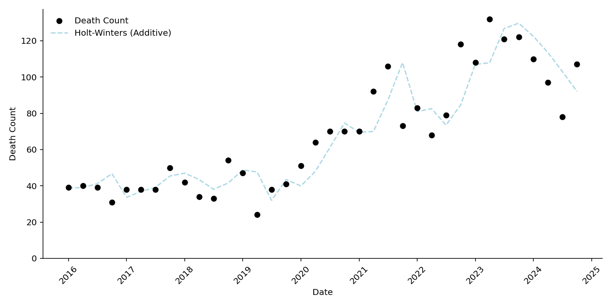
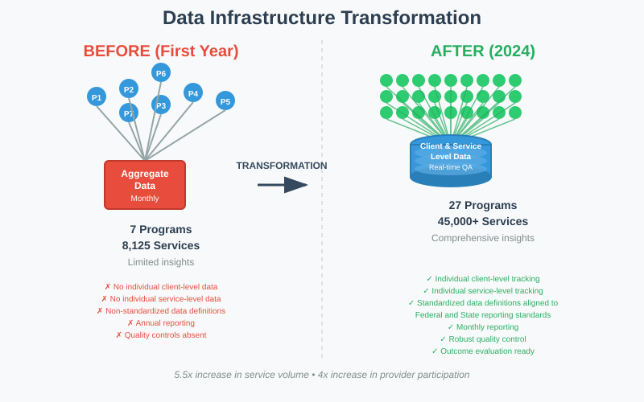

## 📌 TL;DR

* Spearheaded the complete redesign of the data and reporting infrastructure for Pierce County's $30 million behavioral health services portfolio.
* Increased program data collection from 7 providers submitting aggregate data to 27 providers submitting client-level data, capturing over 90,000 services for 18,000 clients since January 2024.
* Developed a comprehensive data quality assurance codebase and coached two analysts in its implementation, ensuring high-fidelity data from providers.
* Negotiated critical data-sharing agreements with state agencies to enable future outcome evaluations on the intersection of behavioral health with the criminal justice system and employment.

---

## 🌎 Overview

Pierce County's strategic plan identifies "Healthy People" as a critical focus area. This priority is underscored by a sobering statistic: between 2016 and 2023, drug-induced deaths in the county rose from 149 to 392, representing a 160% increase. Furthermore, this crisis disproportionately affects vulnerable populations. My analysis revealed that for every $10,000 decrease in a neighborhood's median household income, there is a 12% increase in overdose-related 911 calls.

Technical Note 💡

This finding comes from a Poisson regression analysis of the number of overdose-related calls in 2023 regressed against American Community Survey data on household median income at the Census tract level. An offset for population size was included in the analysis.  

Data for Drug-induced deaths (below) come from the Washington Department of Health's tracking [network](https://doh.wa.gov/data-and-statistical-reports/washington-tracking-network-wtn/opioids/overdose-dashboard) filtered to Pierce County and any death.

**Figure 1:** Drug-induced deaths in Pierce County have risen dramatically, underscoring the urgency of data-driven behavioral health interventions.

{fig-align="center"}  

When I joined the county's behavioral health initiatives in 2022, the data landscape was fragmented. To effectively address the county's needs, a robust data infrastructure was essential. Working with my colleagues, I have been a leader in transforming this system from the ground up.

 

---

## 🏆 Key Achievements & My Contributions

This initiative overhauled how Pierce County understands and manages its behavioral health services. I led a multi-faceted effort that blended stakeholder collaboration, resilient technical design, and team leadership.

**1. Stakeholder Collaboration & System Design** My approach centered on group processes to gather precise requirements from over 30 service providers, program managers, data engineers, and legal teams. Through numerous ongoing meetings, I advocated for shifting from aggregated metrics to client-level data submission, explaining that disaggregation is essential for any meaningful racial equity analysis. I developed the technical specifications for data files, including detailed variable definitions and reporting cadences, while iteratively adapting them to balance analytical rigor with the operational realities of our diverse providers.

**2. Data Engineering and ETL Enhancements** To create a resilient and scalable system, I independently sourced and specified several key enhancements to the data ingestion (ETL) process for our data engineering teams to implement. These included:
- **Modular Integration:** Architecting the ETL pipeline so that a data submission failure from one program would not halt the entire system.
- **Data Submission Logging:** Designing a logging system to track submissions in accordance with county data retention policies.
- **Increased Flexibility:** Making the ETL non-case-sensitive and ideating a protocol to automatically map common invalid values to valid categories, which significantly reduced submission errors.

**3. Data Quality Assurance & Team Leadership** Leading a team of two analysts, I designed and implemented a suite of automated data validation scripts in R. These scripts provided real-time, actionable feedback to providers on how to correct their submissions, identifying invalid values, mismatched client IDs between files, and inconsistent dates. This collaborative work required a new, distributed workflow, and I mentored the analysts on code structure, functional programming, and version control with Git.

**4. Strategic Documentation and Future Vision** To ensure the system's longevity for new contracts, I architected a comprehensive, 30-plus page business requirements document. This document serves as a complete protocol for tracking, logging, and validating data and includes specifications for automated provider communications. This foundational work set the technical agenda for two separate teams—Software Development and IT-Data Services—for the next contracting cycle.

 

{fig-align="center"} 

---

## 🚀 Next Steps

The foundation we've built is now enabling deeper, more impactful analyses.

-   **ETL Enhancements & Testing:** The data pipeline enhancements I designed are currently being implemented by our engineering teams. I will be conducting extensive unit testing in the fall of 2025 before the full rollout with the 2026 contracts.
-   **Healthcare Outcomes Analysis:** With healthcare claims data received in spring 2025, I am now analyzing the impact of program participation on health outcomes. This analysis is on track for completion by the end of 2025.
-   **Holistic Program Evaluation:** Beginning in 2026, I will leverage the data-sharing agreements I secured to conduct a "whole-person" analysis, evaluating how our behavioral health programs influence criminal justice involvement, educational attainment, and employment outcomes.

